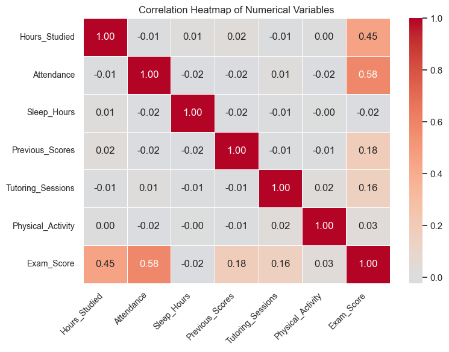
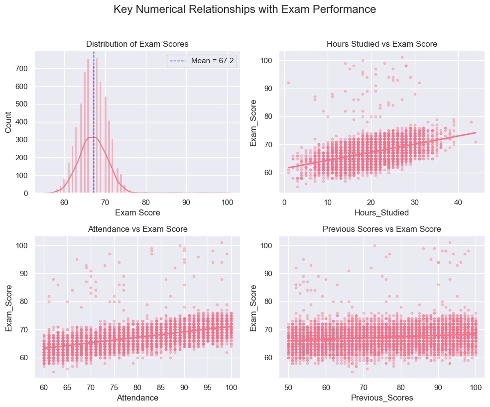
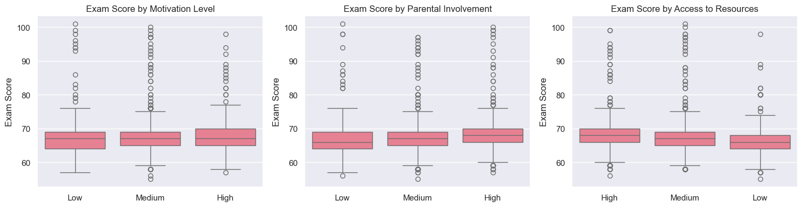
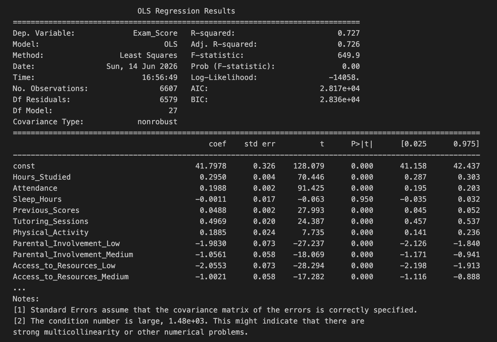
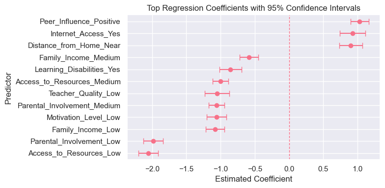
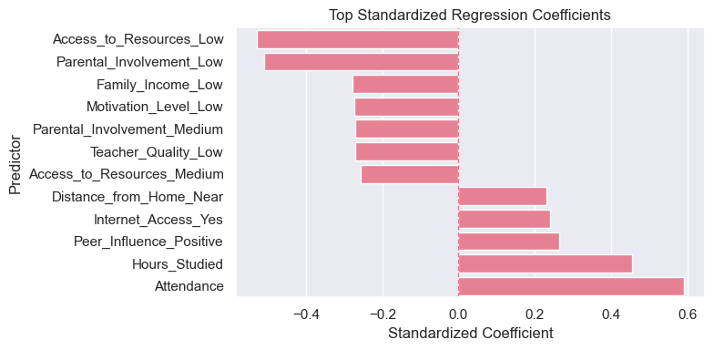
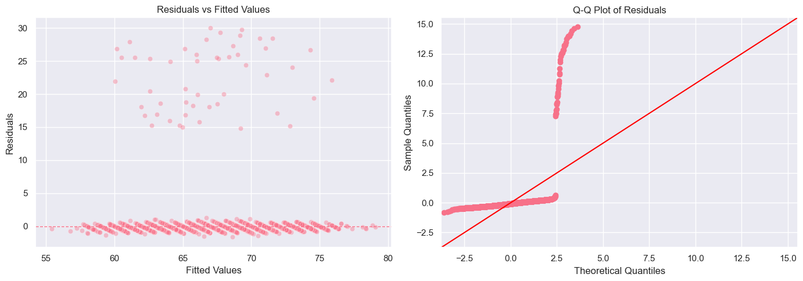
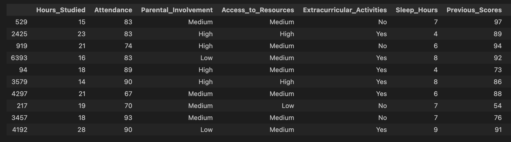
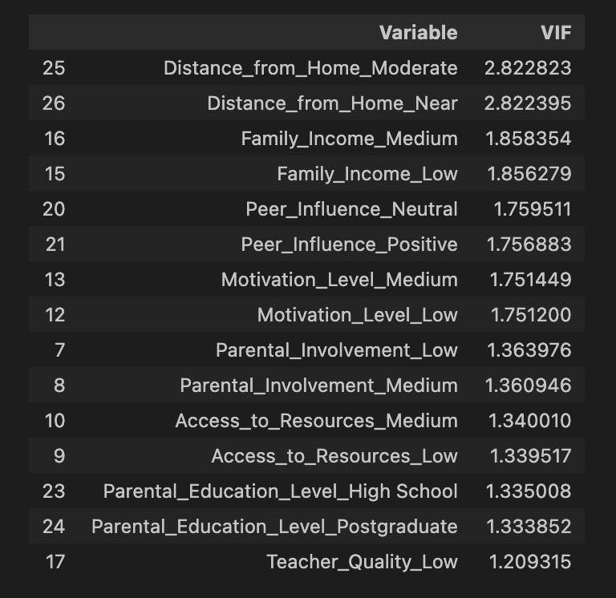

# Student Performance Factors: Regression and Statistical Inference Analysis

## Project Overview

This project investigates factors associated with student academic performance using exploratory data analysis and multiple linear regression.

The goal is not only to build a predictive model, but also to interpret coefficients, evaluate statistical significance, examine confidence intervals, check model assumptions, and discuss limitations.

---

## Multiple Linear Regression

The analysis uses a multiple linear regression model of the form:

$$
Y = \beta_0 + \beta_1X_1 + \beta_2X_2 + \cdots + \beta_pX_p + \varepsilon
$$

where:

- $Y$ represents the exam score
- $\beta_0$ is the intercept
- $\beta_i$ represents the effect of predictor $X_i$
- $\varepsilon$ is the random error term

---

## Dataset

- 6,607 student observations
- Academic, behavioral, socioeconomic, and school-related predictors

Target variable:
- `Exam_Score`

Predictors include:
- Hours studied
- Attendance
- Sleep hours
- Previous scores
- Tutoring sessions
- Motivation level
- Parental involvement
- Access to resources
- Family income
- Teacher quality
- Peer influence
- Learning disabilities
- Distance from home
- Gender

---

## Methods

This project applies:
- Exploratory data analysis
- Correlation analysis
- Multiple linear regression
- Statistical inference using p-values and confidence intervals
- Standardized coefficient analysis
- Residual diagnostics
- Variance Inflation Factor analysis for multicollinearity

---

## Exploratory Data Analysis (EDA)

### Correlation Structure

Key observations:
- Attendance showed the strongest correlation with exam score (0.58)
- Hours studied showed a moderate positive correlation (0.45)
- Previous scores and tutoring sessions showed weaker positive relationships
- Most predictors exhibited low pairwise correlations, suggesting limited multicollinearity

---

### Numerical Relationships

Key observations:
- Exam scores increase with attendance and study hours
- Previous scores show a positive but weaker relationship
- The score distribution is approximately centered around 67 points

---

### Categorical Predictors

- Higher parental involvement is associated with higher exam scores
- Better access to resources is associated with better performance
- Higher motivation levels generally correspond to higher scores

---

## Multiple Linear Regression 

Model Fit Summary:
- R-squared: 0.727
- Adjusted R-squared: 0.726
- F-statistic: 649.9
- Prob (F-statistic): 0.00

---

### Confidence intervals for regression coefficients:

$$
\hat{\beta} \pm t^* \cdot SE(\hat{\beta})
$$

Key findings:
- Positive peer influence, internet access, and proximity to school were associated with higher exam scores
- Low parental involvement and low access to resources showed the strongest negative effects
- Confidence intervals remained relatively narrow due to the large sample size

---

### Standardized Coefficients

Key findings:
- Attendance was the strongest positive predictor
- Hours studied was the second strongest positive predictor
- Low access to resources and low parental involvement showed the largest negative standardized effects

---

## Model Diagnostics

### Residual Analysis

- Residuals were generally centered around zero
- Q-Q plots indicated deviations from normality in the upper tail
- Several large positive residuals were present
- Influence analysis showed these observations did not dominate model estimates

---

### Investigate Large Residuals and Influential Points

- Influence analysis suggested that these unusual observations did not dominate the overall regression results based on Cook's distance.

---

### Multicollinearity Check Using VIF

- The VIF values are all below 3, indicating no evidence of serious multicollinearity among the predictors

---

# Model Performance

| Metric      | Value |
| ----------- | ----- |
| R²          | 0.727 |
| Adjusted R² | 0.726 |
| Sample Size | 6,607 |

The final model explained approximately 72.7% of the variation in student exam scores.

---

## Limitations

- This analysis is observational, so the results should be interpreted as associations rather than causal effects.
- Important factors such as study quality, individual ability, mental health, learning strategies, and school environment were unavailable.
- Missing categorical values were imputed using the mode to preserve the full dataset.

---

## Conclusion

- This project demonstrates how multiple linear regression can be used not only for prediction, but also for statistical interpretation and inference.
- The analysis highlights the importance of combining coefficient interpretation, confidence intervals, standardized effects, diagnostic checking, and discussion of limitations when drawing conclusions from data.

---

## Tools Used

- Python
- pandas
- NumPy
- matplotlib
- seaborn
- statsmodels
- scikit-learn
- Jupyter Notebook
